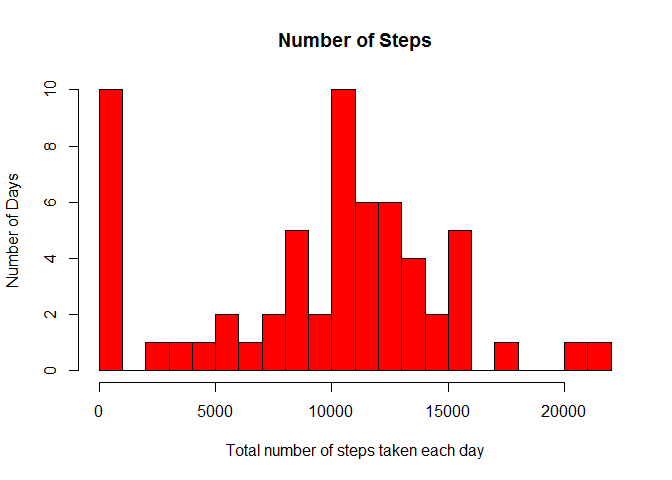

# Reproducible Research: Peer Assessment 1

```r
Sys.setlocale(category = "LC_ALL", locale = "English")
```

```
## [1] "LC_COLLATE=English_United States.1252;LC_CTYPE=English_United States.1252;LC_MONETARY=English_United States.1252;LC_NUMERIC=C;LC_TIME=English_United States.1252"
```

## Loading and preprocessing the data
Loading data and converting to proper formats.

```r
dataTable <- read.csv("activity.csv", colClasses = "character")
dataTable$steps <- as.numeric(dataTable$steps)
dataTable$date <- as.Date(dataTable$date, "%Y-%m-%d")
dataTable$interval <- as.numeric(dataTable$interval)
head(dataTable)
```

```
##   steps       date interval
## 1    NA 2012-10-01        0
## 2    NA 2012-10-01        5
## 3    NA 2012-10-01       10
## 4    NA 2012-10-01       15
## 5    NA 2012-10-01       20
## 6    NA 2012-10-01       25
```

Generate a list of unique dates from data.

```r
dateList <- sort(dataTable[!duplicated(dataTable[,"date"]),"date"])
summary(dateList)
```

```
##         Min.      1st Qu.       Median         Mean      3rd Qu. 
## "2012-10-01" "2012-10-16" "2012-10-31" "2012-10-31" "2012-11-15" 
##         Max. 
## "2012-11-30"
```
Generate a list of unique intervals from data.

```r
intervalList <- sort(dataTable[!duplicated(dataTable[,"interval"]),"interval"])
summary(intervalList)
```

```
##    Min. 1st Qu.  Median    Mean 3rd Qu.    Max. 
##     0.0   588.8  1178.0  1178.0  1766.0  2355.0
```

## What is mean total number of steps taken per day?  

Histogram of steps:

```r
dtStats <- data.frame(date = character(0), steps = numeric(0))
dtStats$date <- as.Date(dtStats$date, "%Y-%m-%d")

for(currentDate in dateList)
{
  dailySteps <- dataTable[currentDate == dataTable$date, "steps"]
  dailySum <- sum(dailySteps, na.rm = TRUE)
  
  tempDT <- data.frame(date = currentDate, steps = dailySum)
  tempDT$date <- as.Date(tempDT$date, origin="1970-01-01")
  
  dtStats <- rbind(dtStats, tempDT)
}

hist(dtStats$steps, breaks = 20, main="Number of Steps", xlab="Total number of steps taken each day", ylab = "Number of Days", col="red")
```

 

The mean number of steps:

```r
mean(dtStats$steps)
```

```
## [1] 9354.23
```

The median number of steps:

```r
median(dtStats$steps)
```

```
## [1] 10395
```

## What is the average daily activity pattern?  

```r
count <- as.numeric(0)
daStats <- data.frame(interval = numeric(0), steps = numeric(0))

for(currentInterval in intervalList)
{
  count <- count + 1
  stepStore <- dataTable[currentInterval == dataTable$interval, "steps"]
  numInstanceInterval <- length(stepStore)
  avgSteps <- sum(stepStore, na.rm = TRUE) / numInstanceInterval
  
  tempDT <- data.frame(interval = currentInterval, steps = avgSteps)
  
  daStats <- rbind(daStats, tempDT)
}

plot(daStats$interval, daStats$steps,axes = F, type="l", col="green", xlab="Time", ylab="Average Number of Steps", main="Average Daily Activity Pattern")
axis(1,at=c(0,600,1200,1800,2400), label = c("0:00","6:00","12:00","18:00","24:00"))
axis(2)
```

 

The 5-minute interval that contains the maximum number of steps is: 

```r
daStats[max(daStats$steps), "interval"]
```

```
## [1] 1450
```


## Imputing missing values  

Number of NA Values:

```r
revDataTable <- dataTable

length(revDataTable[is.na(revDataTable$steps), "steps"])
```

```
## [1] 2304
```

Strategy: Daily averages were used to fill the NA values whenever daily averages are avaliable. If daily averages are not avaliable, the averages of the 5 minute time slot across all dates for the time slot having the NA value is used.

Creating a new dataset that is equal to the original dataset but with the missing data filled in.

```r
for(currentDate in dateList)
{
  dailySteps <- revDataTable[currentDate == revDataTable$date, "steps"]
  numDailySteps <- length(dailySteps[!is.na(dailySteps)])
  if(numDailySteps > 0)
  {
    revDataTable[(currentDate == revDataTable$date) & is.na(revDataTable$steps), "steps"] <- dtStats[(currentDate == dtStats$date), "steps"] / numDailySteps
  }
}

for(currentInterval in intervalList)
{
  intervalSteps <- revDataTable[currentInterval == revDataTable$interval, "steps"]
  numIntervalSteps <- length(intervalSteps[!is.na(intervalSteps)])

  revDataTable[(currentInterval == revDataTable$interval) & is.na(revDataTable$steps), "steps"] <- daStats[(currentInterval == daStats$interval), "steps"]
}

revStats <- data.frame(date = character(0), steps = numeric(0))
revStats$date <- as.Date(revStats$date, "%Y-%m-%d")

for(currentDate in dateList)
{
  dailySteps <- revDataTable[currentDate == revDataTable$date, "steps"]
  dailySum <- sum(dailySteps, na.rm = TRUE)
  
  tempDT <- data.frame(date = currentDate, steps = dailySum)
  tempDT$date <- as.Date(tempDT$date, origin="1970-01-01")
  
  revStats <- rbind(revStats, tempDT)
}
head(revStats)
```

```
##         date    steps
## 1 2012-10-01  9354.23
## 2 2012-10-02   126.00
## 3 2012-10-03 11352.00
## 4 2012-10-04 12116.00
## 5 2012-10-05 13294.00
## 6 2012-10-06 15420.00
```

Histogram of the total number of steps taken each day:

```r
hist(revStats$steps, breaks = 20, main="Number of Steps", xlab="Total number of steps taken each day", ylab = "Number of Days", col="red")
```

 

The revised mean is:

```r
mean(revStats$steps)
```

```
## [1] 10581.01
```

The revised median is: 

```r
median(revStats$steps)
```

```
## [1] 10395
```

These values differ from the estimates from the first part of the assignment.

The impact of imputing missing data increased the mean of the total daily number of steps while the median of the total daily number of steps remained the same.

## Are there differences in activity patterns between weekdays and weekends?

Label each day as weekend or weekday.

```r
numrows <- length(dateList)
dateDT <- data.frame(date = numeric(numrows), weekdays = character(numrows), daytype = character(numrows))
dateDT$date <- as.Date(dateList, origin="1970-01-01")
dateDT$weekdays <- weekdays(as.Date(dateDT$date))
dateDT$daytype <- ifelse(dateDT$weekdays %in% c("Saturday", "Sunday"),"Weekend", "Weekday")
revDataTable <- merge(revDataTable, dateDT, "date")
head(revDataTable)
```

```
##         date      steps interval weekdays daytype
## 1 2012-10-01 1.49180328        0   Monday Weekday
## 2 2012-10-01 0.29508197        5   Monday Weekday
## 3 2012-10-01 0.11475410       10   Monday Weekday
## 4 2012-10-01 0.13114754       15   Monday Weekday
## 5 2012-10-01 0.06557377       20   Monday Weekday
## 6 2012-10-01 1.81967213       25   Monday Weekday
```

Calcluating the average for each interval of each day type.

```r
avgIntervalByDay <- aggregate(revDataTable$steps, by=list(revDataTable$interval, revDataTable$daytype), mean)
colnames(avgIntervalByDay)[1] <- "interval"
colnames(avgIntervalByDay)[2] <- "daytype"
colnames(avgIntervalByDay)[3] <- "meansteps"
head(avgIntervalByDay)
```

```
##   interval daytype  meansteps
## 1        0 Weekday 2.22112933
## 2        5 Weekday 0.43934426
## 3       10 Weekday 0.17085610
## 4       15 Weekday 0.19526412
## 5       20 Weekday 0.09763206
## 6       25 Weekday 1.55373406
```

```r
tail(avgIntervalByDay)
```

```
##     interval daytype   meansteps
## 571     2330 Weekend  1.34528689
## 572     2335 Weekend 11.51024590
## 573     2340 Weekend  6.23360656
## 574     2345 Weekend  1.69467213
## 575     2350 Weekend  0.02459016
## 576     2355 Weekend  0.11680328
```

Creating the plot of the average for each interval of each day type.

```r
library(lattice)
xyplot(meansteps ~ interval | daytype, data = avgIntervalByDay, layout = c(1, 2), type="l", xlab = "Interval", ylab = "Number of steps", col="green")
```

 
